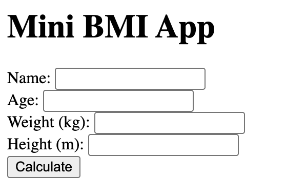

# Flask BMI App 🧮

A simple web application built with [Flask](https://flask.palletsprojects.com/) that calculates Body Mass Index (BMI) from user input.

## 🚀 Features
- Enter **name, age, weight, and height** in a web form
- Calculates BMI using the standard formula
- Classifies result:
  - Underweight
  - Normal weight
  - Overweight
  - Obese
- Clean HTML interface built with Flask templates
- Runs locally on your machine

## 🖼️ Screenshot
*(Add one once you’re ready — just take a screenshot of the app in your browser and upload it here)*



## ⚙️ Installation

1. Clone the repo:
   ```bash
   git clone https://github.com/mistyhere/flask-bmi-app.git
   cd flask-bmi-app
